<p align="center">
  
</p>

<h1 align="center">Meikai Browser</h1>

<p align="center">
  <strong>A Minimal, Native Browser Built with Tauri</strong>
</p>

> ## ⚠️ DISCONTINUED PROJECT
> 
> **This Tauri-based version of Meikai Browser has been discontinued.**
> 
> The project has evolved into a proprietary AI-powered Agentic Browser. 
> 
> **Visit the full version at: [www.meikai.rhishav.com](https://meikai.rhishav.com)**
> 
> This repository is now open-sourced for community reference. No active development or support is provided for this version.

---

## About

**Meikai** is a minimal, native web browser experiment built with **Tauri 2.0**. It leverages the system's native WebView2 (on Windows) to provide a lightweight browsing experience with a unique UI paradigm featuring transformable window modes.

Unlike traditional browsers, Meikai explores a different interaction model with:
- **Panel Mode**: A beautiful launcher interface for quick access
- **Dock Mode**: A compact floating bar that stays on top
- **MiniPanel Mode**: An expanded dock with search and bookmarks

## ✨ Features

### 🎨 Unique UI Paradigm
- **Transformable Windows** - Seamlessly switch between Panel, Dock, and MiniPanel modes
- **Frameless Design** - Clean, borderless windows with custom title bars

### 🚀 Performance
- **Native WebView2** - Uses the system's native web engine (no bundled browser)
- **Lightweight** - Minimal memory footprint compared to Chromium-based browsers
- **Fast Startup** - Near-instant launch times

### 🔧 Browser Features
- **Multi-Window Support** - Open multiple browsing windows simultaneously
- **Navigation Controls** - Back, forward, reload, and home functionality
- **Smart URL Bar** - Auto-detects URLs vs search queries
- **Bookmarks** - Save and manage your favorite sites via the Tray
- **Quick Links** - Customizable quick access buttons

### 🎯 Window Modes

| Mode | Description |
|------|-------------|
| **Panel** | Full launcher interface with search, quick links, and settings |
| **Dock** | Minimal floating bar at the top of the screen, always visible |
| **MiniPanel** | Expanded dock with bookmarks, search, and window management |

## 🛠️ Tech Stack

### Frontend
| Technology | Version | Purpose |
|------------|---------|---------|
| [React](https://react.dev/) | 19.1 | UI Framework |
| [TypeScript](https://www.typescriptlang.org/) | 5.8 | Type Safety |
| [Vite](https://vitejs.dev/) | 7.0 | Build Tool |

### Backend
| Technology | Version | Purpose |
|------------|---------|---------|
| [Tauri](https://tauri.app/) | 2.0 | Desktop Framework |
| [Rust](https://www.rust-lang.org/) | 2021 Edition | Backend Logic |
| [WebView2](https://developer.microsoft.com/microsoft-edge/webview2/) | System | Web Rendering |

### Tauri Plugins
- `tauri-plugin-opener` - URL handling
- `tauri-plugin-shell` - Shell commands
- `tauri-plugin-fs` - File system access
- `tauri-plugin-dialog` - Native dialogs

## 🚀 Getting Started

### Prerequisites

- **Node.js** 18+ and npm
- **Rust** (latest stable) - [Install Rust](https://rustup.rs/)
- **Windows**: WebView2 Runtime (usually pre-installed on Windows 10/11)
- **Linux**: WebKitGTK dependencies
- **macOS**: Xcode Command Line Tools

### Installation

1. **Clone the repository**
   ```bash
   git clone https://github.com/Rhishavhere/Meikai-(Tauri v1)-opensourced.git
   cd meikai-browser
   ```

2. **Install dependencies**
   ```bash
   npm install
   ```

3. **Run in development mode**
   ```bash
   npm run tauri dev
   ```

4. **Build for production**
   ```bash
   npm run tauri build
   ```

### Platform-Specific Setup

<details>
<summary><strong>Windows</strong></summary>

Windows 10/11 typically has WebView2 pre-installed. If not:
1. Download and install [WebView2 Runtime](https://developer.microsoft.com/microsoft-edge/webview2/)
2. Ensure you have the Visual Studio C++ Build Tools installed

</details>

<details>
<summary><strong>Linux (Fedora)</strong></summary>

```bash
sudo dnf install gtk3-devel webkit2gtk4.1-devel libappindicator-gtk3-devel librsvg2-devel
```

</details>

<details>
<summary><strong>Linux (Ubuntu/Debian)</strong></summary>

```bash
sudo apt install libgtk-3-dev libwebkit2gtk-4.1-dev libappindicator3-dev librsvg2-dev patchelf
```

</details>

<details>
<summary><strong>macOS</strong></summary>

```bash
xcode-select --install
```

</details>

## 📁 Project Structure

```
meikai-browser/
├── src/                        # Frontend (React + TypeScript)
│   ├── App.tsx                 # Main application component
│   ├── main.tsx                # React entry point
│   ├── index.css               # Global styles
│   ├── components/             # UI Components
│   │   ├── Panel/              # Panel mode components
│   │   │   ├── Home.tsx        # Home view with quick links
│   │   │   ├── Settings.tsx    # Settings view
│   │   │   ├── Profile.tsx     # User profile
│   │   │   └── Tray.tsx        # Bookmarks tray
│   │   ├── Dock.tsx            # Dock mode component
│   │   ├── MiniPanel.tsx       # Expanded dock component
│   │   ├── TitleBar.tsx        # Custom title bar
│   │   └── BetaDisclaimer.tsx  # Beta notice overlay
│   └── hooks/                  # Custom React hooks
│
├── src-tauri/                  # Backend (Rust)
│   ├── src/
│   │   ├── lib.rs              # Main library & Tauri commands
│   │   ├── main.rs             # Application entry point
│   │   ├── window.rs           # Window management
│   │   ├── navigation.rs       # Browser navigation
│   │   ├── search.rs           # Search functionality
│   │   ├── titlebar.rs         # Title bar controls
│   │   ├── url_monitor.rs      # URL monitoring
│   │   └── window_controls.rs  # Window control commands
│   ├── capabilities/           # Tauri 2.0 permissions
│   ├── icons/                  # Application icons
│   ├── Cargo.toml              # Rust dependencies
│   └── tauri.conf.json         # Tauri configuration
│
├── index.html                  # HTML entry point
├── vite.config.ts              # Vite configuration
├── package.json                # Node.js dependencies
└── INFO.md                     # Detailed customization guide
```

## ⚙️ Configuration

### Window Settings

Modify `src-tauri/tauri.conf.json`:

```json
{
  "app": {
    "windows": [
      {
        "title": "Meikai Browser",
        "width": 900,
        "height": 600,
        "decorations": false,
        "transparent": true,
        "resizable": false,
        "center": true
      }
    ]
  }
}
```

### Permissions

Tauri 2.0 requires explicit permissions. See `src-tauri/capabilities/default.json` for the list of enabled capabilities.

## 🎨 Customization

For detailed customization instructions, see the [INFO.md](./INFO.md) file which includes:

- Modifying the Panel UI
- Customizing the Dock/Notch appearance
- Adding new navigation features
- Changing window behavior
- Adding new Tauri commands

## 📜 Scripts

| Command | Description |
|---------|-------------|
| `npm run dev` | Start Vite dev server |
| `npm run build` | Build frontend for production |
| `npm run tauri dev` | Run Tauri in development mode |
| `npm run tauri build` | Create production builds (MSI/NSIS) |

## 🏗️ Architecture

```mermaid
flowchart TB
    subgraph Frontend["Frontend (React + TypeScript)"]
        direction TB
        App["App.tsx<br/>Main Controller"]
        
        subgraph Modes["Window Modes"]
            Panel["Panel Mode<br/>━━━━━━━━━━━<br/>Home • Settings<br/>Profile • Tray"]
            Dock["Dock Mode<br/>━━━━━━━━━━<br/>Floating Bar"]
            MiniPanel["MiniPanel Mode<br/>━━━━━━━━━━━━━<br/>Search • Tabs"]
        end
        
        App --> Modes
    end

    subgraph IPC["Tauri IPC Layer"]
        invoke["invoke()"]
        listen["listen()"]
    end

    subgraph Backend["Backend (Rust)"]
        direction TB
        
        subgraph Commands["Tauri Commands"]
            window["window.rs<br/>━━━━━━━━━━<br/>create_content_window<br/>transform_to_dock"]
            nav["navigation.rs<br/>━━━━━━━━━━━━<br/>go_back • go_forward<br/>reload • navigate"]
            controls["window_controls.rs<br/>━━━━━━━━━━━━━━━<br/>minimize • maximize<br/>close"]
        end
        
        subgraph Plugins["Tauri Plugins"]
            fs["plugin-fs"]
            dialog["plugin-dialog"]
            shell["plugin-shell"]
        end
    end

    subgraph Native["Native Layer"]
        WebView2["WebView2 Runtime<br/>━━━━━━━━━━━━━━━<br/>Web Content Rendering"]
        OS["Operating System<br/>━━━━━━━━━━━━━━<br/>Window Management"]
    end

    Frontend <-->|"Commands & Events"| IPC
    IPC <--> Backend
    Commands --> Native
    Plugins --> OS
    WebView2 <-->|"URL Navigation"| nav
```



### Data Flow


## 🤝 Contributing

As this project is discontinued, no active contribution is expected. However, feel free to:

- Fork the repository for your own experiments
- Reference the architecture for your own projects

## 📄 License

This project is open-sourced under the [MIT License](./LICENSE).

## 👨‍💻 Author

**Rhishav Dhali**

- Website: [rhishav.com](https://rhishav.com)
- Try Meikai (Full Version): [meikai.rhishav.com](https://meikai.rhishav.com)

---


<p align="center">
  <sub>Meikai - The Web Reimagined</sub>
</p>
